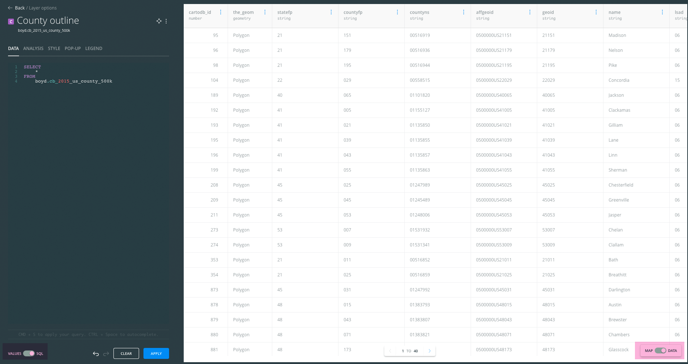
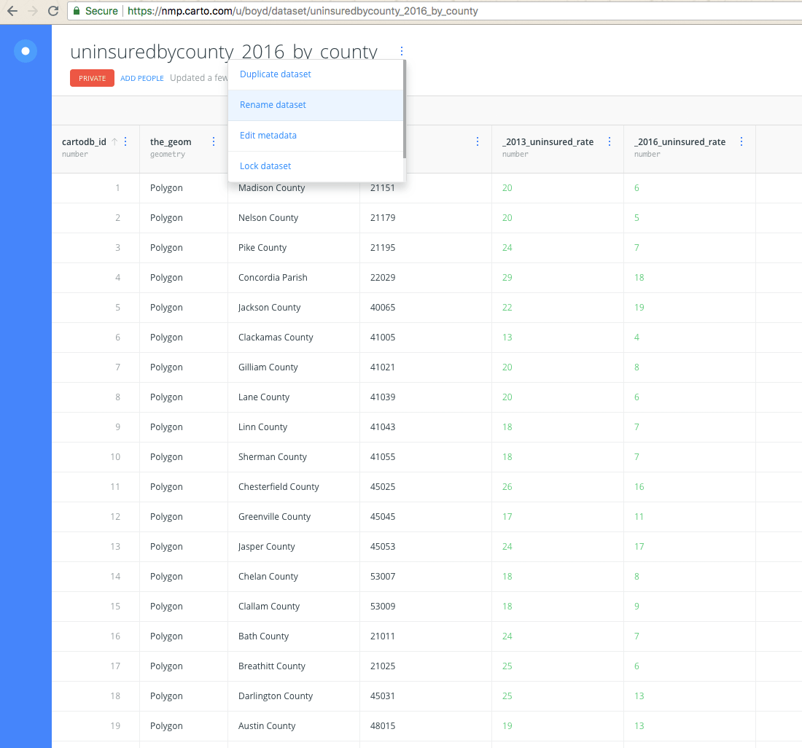
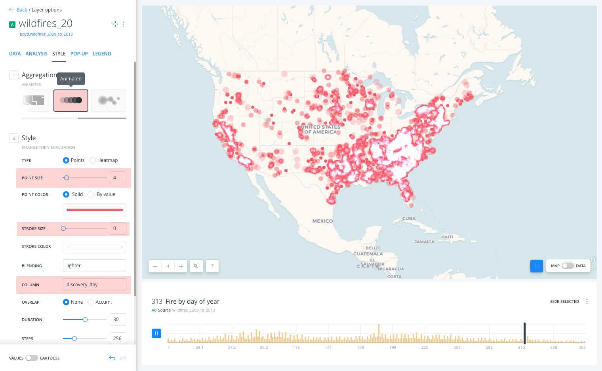

# Lesson 08: Thematic mapping with CARTO

## Table of Contents

<!-- TOC -->

- [Lesson 08: Thematic mapping with CARTO](#lesson-08-thematic-mapping-with-carto)
    - [Table of Contents](#table-of-contents)
    - [Overview](#overview)
    - [Data files](#data-files)
    - [Creating a CARTO account and profile](#creating-a-carto-account-and-profile)
    - [Exploring the basics of CARTO](#exploring-the-basics-of-carto)
    - [Loading data into CARTO](#loading-data-into-carto)
        - [Uploading data from your local machine to CARTO](#uploading-data-from-your-local-machine-to-carto)
        - [Loading data into CARTO from a remote source](#loading-data-into-carto-from-a-remote-source)
    - [The CARTO Data and Map Views](#the-carto-data-and-map-views)
        - [Styling layers and CartoCSS](#styling-layers-and-cartocss)
    - [Performing a table join in CARTO](#performing-a-table-join-in-carto)
    - [Making a thematic map with CARTO](#making-a-thematic-map-with-carto)
        - [Adding pop-up windows and a legend](#adding-pop-up-windows-and-a-legend)
    - [Publishing your CARTO map to the web](#publishing-your-carto-map-to-the-web)
        - [Embed CARTO map on web pages](#embed-carto-map-on-web-pages)
    - [Addendum: Interactive widgets for data analysis](#addendum-interactive-widgets-for-data-analysis)
    - [Resources and references](#resources-and-references)

<!-- /TOC -->

## Overview

In this module, we continue our move away from purely-desktop GIS operations to the exciting land of the web and web mapping. Within this module, we introduce a key player in the web mapping world: [CARTO](https://CARTO.com), which rebranded from CartoDB in July 2016.

We can think broadly of CARTO as contributing to the backend of our web mapping process, particularly how we store and access our data in a PostGIS database. They also provide the ability to make effective data-driven web maps quickly through their web interface, JavaScript library, and web services.

We'll first create a CARTO account and briefly get acquainted with some of the awesomeness that it provides. Then, we'll figure out how to link it up with QGIS. Once we do all that, we'll be ready to explore a use case to see how we can integrate CARTO within our mapping workflow. Specifically, we're going to begin by making a US counties choropleth map by joining some tabular data to some county polygons.

Let's get started!

## Data files

* Find on Canvas an *UninsuredByCounty_2016.zip* and the *2016CountyHealthRankingsNationalData.ods* files containing rates of uninsured adults and metadata.
* US counties from previous lessons. We'll also explore how to add files to CARTO from remote sources. No more data stored on our computer!

## Creating a CARTO account and profile

The first step is to visit the New Maps Plus [CARTO website: https://nmp.carto.com/signup](https://nmp.carto.com/signup) and create an account using your uky.edu email. We have an educational account with CARTO, which gives you free services as long as you're in the New Maps Plus program. If you want to explore CARTO with your own account, you can us the [GitHub Education Pack](https://education.github.com/pack) to get free access for two years.

You'll want to choose a good username and take some time and set up your CARTO profile. Eventually, you'll be producing some maps with CARTO, and they offer a nice public-facing interface with which you can share some of your maps and data. They even offer an option to indicate that you're "Available For Hire," so if you're able to make a few compelling maps hosted on CARTO, perhaps a potential employer will find you!

## Exploring the basics of CARTO

If you spend some time looking through [CARTO's website](https://CARTO.com/) &ndash; and you should! &ndash; you'll see that you can use CARTO to perform an amazing array of mapping tasks (some of which we've been completing using QGIS). In particular, you'll want to minimally glance through:

* [CARTO's Documentation](https://docs.CARTO.com/) (including API documentation for using some of CARTO's mapping platform and many useful tutorials for exploring specific CARTO functionality).
* [CARTO workshops](http://cartodb.github.io/training/) (a series of workshops given by CARTO)

CARTO's educational materials are quite excellent, and New Maps Plus encourages you to spend time reading through these and practicing some of their tutorials. The mapping and GIS world is immense, and the more ways you can approach problems and hear the material articulated, the better of you will be.

Once you've created an account and logged in, there are couple key things we want to point and explore before we dive into the exchange of data and maps between QGIS and CARTO. First, note that there are three "views" within CARTO: 

- Home: A dashboard showing some of your latest content and usage metrics
- Maps: A catalog of all your CARTO maps
- Data: A catalog of all the tables you have hosted on CARTO

Pay attention to which one you're in, as you'll be switching between the two as you work with CARTO. These are accessed in the upper-left of the webpage next to your name.

   
Figure 1. CARTO Dashboard. Take some time to familiarize yourself with the [CARTO Builder interface](https://carto.com/learn/guides).

Since you likely have neither maps nor datasets yet, let's first practice getting data into CARTO.


## Loading data into CARTO

CARTO's interface is incredibly flexible and offers various ways to access [datasets already hosted by CARTO](https://CARTO.com/data-library), as well as to load data onto their web servers.

### Uploading data from your local machine to CARTO

A predictable way to get data into your CARTO account is to simply upload a file or directory from your computer. To do this, first select **New Dataset** (you'll need to be in the **Data** view of your dashboard and not the **Maps** view).

   
Figure 2. Selecting a new dataset in CARTO

CARTO supports an [impressive variety of file formats](https://carto.com/developers/import-api/guides/importing-geospatial-data/#supported-geospatial-data-formats) including GeoPackage, Shapefiles, GeoJSON, comma-separated and tab delimited files, Esri File Geodatabase and different spreadsheets. It also supports uploading compressed *.zip* and *.gz* files (i.e., your bundled Shapefiles in a *.zip* file).

Try uploading the *UninsuredByCounty_2016.csv* file included with this module (you may wish to examine the CSV file first within Open Office or a text editor). This CSV shows percent of county population without health insurance in 2013 and 2016. From CARTO's **UPLOAD** page, choose **BROWSE**, locate the file in your local directory structure, and then click **UPLOAD DATASET**. You can also drag and drop the file from your local window into the browser.

   
Figure 3. Selecting a new file

Note the option at the bottom to "Let CARTO automatically guess data types and content on import." Let's leave this checked for the moment to see what happens. Also, note the red lock that signifies that your dataset is private. We'll need to pay attention to this setting if we publish maps and want to share our data.

Once uploaded to and processed by CARTO, you will see your data in the Data View. Note that the values within *the_geom* attribute column for this file are all "null." This is simply tabular data with no spatial information. There are attributes such as state and county names, as well as FIPS ids, with which we can perform a tabular join with some county geometries. However, note that within the county_fips column (which is designated as a number type), CARTO has stripped off the leading zero. CARTO has automatically guessed this field to be a numeric type, and in doing so removed the leading zero. This can create a problem when attempting to do a Join, a problem we'll return to a bit later.

   
Figure 4. The leading zeros of the County FIPS codes have been stripped in the default data connection. To get back your Dashboard, click on the upper-left corner CARTO logo.

Try re-importing the CSV file, but leave the option to "Let CARTO automatically guess data types and content on import" unchecked. This time, you'll notice that CARTO has treated every field as a text string. This can be inconvenient, as you'd then need to manually change each field type (something that CARTO makes quite easy). The advantage is, however, that the leading zero of a column such as our state+county FIPS codes is retained. Again, this small example underscores the importance of paying attention to data types when working with geospatial information.

   
Figure 5. Change your field data type to "Number" for the percent uninsured rate fields.

It's a best practice, once you upload data to CARTO, to immediately enter metadata about the data (click on **Edit metadata...** to the right of the title "uninsuredbycounty_2016" and fill in the fields). The source of the data is [Enroll America](https://www.enrollamerica.org), a nonprofit, nonpartisan health care coalition.

   
Figure 6. Entering metadata for the new dataset

Let's move on now to get some good county data to join with these uninsured data?

### Loading data into CARTO from a remote source

#### Connecting to remote services

A powerful and useful feature of CARTO is the ability to load data from a remote source URL simply by pasting in a URL. In the **CONNECT** page of CARTO, we see a variety of options for loading external data into CARTO. These include data stored within Google Drive or Dropbox or served from an ArcGIS Server. This can be a great solution for giving a client the ability to update a map with new data (e.g., they a simply update the values in a shared Google Spreadsheet document and CARTO will pull in the new information).

#### Uploading files from a remote source

While we've seen how [Natural Earth](http://www.naturalearthdata.com/) is great for grabbing quick Shapefiles, another excellent resource for mapping with the United States is the [Cartographic Boundary Shapefiles](https://www.census.gov/geo/maps-data/data/tiger-cart-boundary.html). These files have been generalized and simplified at various scales for a variety of political sub-units.

Let's upload a county polygon layer. Copy the following URL: http://www2.census.gov/geo/tiger/GENZ2015/shp/cb_2015_us_county_20m.zip.  From **Data** select **New Dataset**. Under the **UPLOAD** tab, paste this URL into the designated field and choose **Submit**.

     
Figure 7. Connecting a remote database to your CARTO account

CARTO also allows you to Sync this dataset if you choose, meaning that if the source data is updated, CARTO will pull in any changes to the file. There's no need to do this now, but if you were using an external data file that is constantly updated, then this could be reflected in the Synced CARTO dataset.

Choose **UPLOAD DATASET**. CARTO fetches the file, unzips it, and loads it into your account.

When finished processing, CARTO will open the data in the **Data View**.

## The CARTO Data and Map Views

First, note that these data encode the state FIPS codes and the county FIPS codes in separate columns, unlike the uninsured adults data we loaded into CARTO above. This will present a challenge for us to complete our anticipated table join. However, the state and county FIPS codes within the county Shapefiles are loaded into CARTO as string types, rather than number types. This usefully prevents the leading zeros from these codes from being removed.

Again, we should enter some metadata for these data before continuing.

Second, note that the **the_geom** field contains Polygon information. This is a PostGIS database! Double-click on one of these values within the **the_geom** field. You're presented with the coordinates of that polygon, in this case encoded as a "MultiPolygon" with latitude and longitude coordinate pairs. This is same output as using the PostGIS function `st_AsText(the_geom)`.

   
Figure 8. **the_geom** field contains PostGIS geometry. Be careful not to edit these values (unless you want to change the location features).

Select **Create Map** to see the county polygons drawn to the map. CARTO will display the county boundaries with a solid default color using the Web Mercator projection.


Figure 9. Create Map of US Counties drawn with default settings

After you create the map, you presented with CARTO's **Builder** interface. The left column represents your layers on the map. The bottom layer, Voyager Basemap, is a mapping tile service that has basemap features rendered at different scales. This is the classic "slippy map". The basemap labels are a separate layer on top of the county polygons. Click on the **Voyager Basemap** to change your basemap. While we can add many layers to this map, we cannot change the default basemap settings or styles.

   
Figure 10. Default Builder view

Click on your county polygon layer *cb_2015_us_county_20m* (or *cb_2015_us_county_500k* depending on the scale you selected) to access **Builder** functions.

In the **DATA** panel we are shown our attribute table columns and the "Add as a widget" option. A widget is a simple visualization technique for your attribute data. It can create a histogram, time series, or do summary statistics on your data. The **ANALYSIS** pane provides tools similar to the ones we use in QGIS and DB Manager. We'll investigate these features later.


   
Figure 11. Builder panels for layers and toggles for code access


Before we move on, let's take a peak at the SQL Window. Click on the **SQL** toggle to switch to the *SQL View* and then click on the **DATA** toggle to switch to table view:

   
Figure 12. Builder panels for layers

```sql

/* Default query when you add a new layer to CARTO */

SELECT
	*
FROM
	boyd.cb_2015_us_county_500k -- notice the dot notation
  /* your CARTO username is a schema */
```

As you work through CARTO, you can always access this window to make custom queries.

### Styling layers and CartoCSS

Access the **STYLE** panel. This visualization tool is simple looking but rather powerful. We can change the polygon's fill color, either as a single symbol or by an attribute, the polygon stroke, and the blending mode with other added layers. Click on the **POLYGON COLOR** symbol to change the color of the polygon fill color. Under the **SOLID** mode we can change the color with [three pickers](http://www.w3schools.com/colors/colors_picker.asp). We are offered HSLa sliders, hexadecimal, and RGBa. The lowercase "a" stands "alpha channel", the amount of opacity in the layer. The sliders can change the Saturation and Lightness (top slider), the Hue (second slider), and the opacity (third slider).

   
Figure 13. The polygon fill color picker with an opacity set to 0.4.

Note the **VALUES/CARTOCSS** switch at the bottom of the **Builder** layer's STYLE panel. Toggle this to enter the CartoCSS editor. Within this text editor we see the CartoCSS style rules that dictate what is displayed on the map and how. "CSS" is an acronym for Cascading Style Sheets, one of the web design markup languages. We're not going to spend a lot of time worrying about how to write these style rules form scratch right now. We recommend you read through [CARTO's CartoCSS documentation](https://carto.com/docs/carto-engine/cartocss/) to gain more understanding.

   
Figure 14. The CartoCSS editor.

However, let's quickly walk through what's happening with this CartoCSS code.

A style "rule" (line 1 `#layer`) selects our layer, i.e., our county polygons, using the hashtag and applies the style rule properties (contained within the curly brackets) to those features. These property rules include the `polygon-fill` and `polygon-opacity` of the polygons (lines 2 and 3), as well as the `line-color`, `line-width`, and `line-opacity` of the lines (lines 4-6).

CartoCSS is quite powerful. For instance, we could add a second layer definition to create cartographic effects like cased lines and fuzzy borders. Since the code is simple text, we can easily modify and share our symbolization properties. Consider the Figure 13 graphic and code block below.

A copy of the layer was generated with `#layer::2` note the "2" suffix is arbitrary could be any value, e.g., `#layer::mysecondlineeffect`. Any effect you define with a `::` double-colon will alway be below the main style definition. Or, you could redefine `#layer` style again. CARTO renders styles bottom to top, just like our map layers in QGIS (except when you use the `::` on a layer).

The line width and opacity were modified to create a glow around the polygon (lines 14-16). It is encouraged that you also add comments to help organize your code (line 9).

   
Figure 15. Adding a copy of the layer for cartographic effect.

```css
#layer {
  polygon-fill: #f45c2e;
  polygon-opacity: 0.4;
  line-width: 1;
  line-color: #FFF;
  line-opacity: 0.5;
}

/* This is a comment */

#layer::2 {
  /* add a second layer
  to make a glow effect */
  line-width: 10;
  line-color: #FFF;
  line-opacity: 0.1;
}
```

Knowing all the property names (e.g., the `polygon-fill` and `line-opacity`) is the tricky part of learning a styling language such as CartoCSS. The values are easier to play with, however. In this case, the color values are encoded as hexadecimal values, opacity values are decimal numbers between 0 and 1, and the line width is whatever number you'd like. The value #f45c2e is a [hexadecimal color code](https://developer.mozilla.org/en-US/docs/Web/Guide/CSS/Getting_started/Color).

Feel free to play around with them within this editor. For instance, try changing the color and adding a second copy of the layer for effect. You can see the style after you hit the **Apply** button at the bottom right. The arrows are for undoing and redoing your CartoCSS edits.

One more important consideration. If you switch to CartoCSS editor, you cannot switch back to the color picker. You can, however, switch into the CartoCSS editor after you apply styles in the default color picker. Also, you should think about copying your CartoCSS code and saving it to your local computer as a text file with a *.css* file extension.

That's enough basics on data loading and the interface tour for now. We highly encourage you to take some time to further explore CARTO's tutorials and documentation on your own.

## Performing a table join in CARTO

You can do the table join with via the SQL in CARTO. Open the *UninsuredByCounty_2016* dataset and then click on the METADATA/SQL toggle switch to access the SQL console. In the console test the following query to join the attribute data to the polygon geometry:

```sql
SELECT
/*
Need the geom from the polygon field.
Note the dot notation. boyd is my schema.
You'll need to change to your username.
*/
  boyd.cb_2015_us_county_20m.the_geom,
/*
These fields are uniquely named in the tables, so we don't need full path.
*/
  county_name,
  geoid,
  _2013_uninsured_rate,  -- make sure you've converted field to number type
  _2016_uninsured_rate  -- make sure you've converted field to number type
FROM
  boyd.uninsuredbycounty_2016, boyd.cb_2015_us_county_20m
where
  county_fips = geoid
```
Inspect the attributes after the join and you should see something similar to:

   
Figure 16. Performing table join in SQL

If all looks good, then click table operation, **Create Dataset from query** and rename the output to "UninsuredAdults_2016"

   
Figure 17. Renaming output dataset and verify fields are numeric.

## Making a thematic map with CARTO

Now that we have our uninsured adults data tied to our county geometries and we're back in CARTO let's use that dataset to make a quick web map.

Find your newly added layer in CARTO Datasets and select the layer. We want to map 2016 uninsured rates. Click on **Create Map** to begin the visualization. Select the layer in Builder and then the **STYLE** panel. Instead of changing the polygon's fill the same way for all polygons, we are going to change the polygon based on field value. Select **By Value** and find the 2016 uninsured rate column.

We can then adjust the number of classes (CARTO curiously calls them "**Buckets**"), as well as the method of **Quantification**. Try changing the quantification method between equal area and quantiles to inspect the differences in the rendered map. CARTO's interface quickly allow us to produce a choropleth map of these uninsured adult data.


   
Figure 18. Creating a choropleth map using CARTO Builder

Continue to style the other properties for your polygon and consider changing basemaps. Zoom in and out to see how your styles look different at different zoom levels. CARTO has many color palettes to use. While the color choice is largely up to the map maker, you should avoid using [divergent color schemes](http://colorbrewer2.org/) on data without a known total average.

We see that CARTO adds a legend and an estimated average, presumably for the US uninsured rates. However, you cannot do statistics on derived rates like percentages, so some of the features offered might be dubious. Consider two counties. One county has one million people and an uninsured rate of 10% and another county has one hundred people at a 20% rate does NOT make a combined 15% average for those two counties.

To override the dynamic calculation of statistics, write in a legend value for the *LEFT LABEL* and *RIGHT LABEL* text fields:

   
Figure 19. Renaming output dataset and verify fields are numeric.

Before we publish this map, switch to the **CartoCSS editor**. We can see that **Builder** has added additional CartoCSS rules. Again, we're not going to dive deep into mastering CartoCSS right now. Making adjustments in Builder and toggling back to inspect the changes in the CartoCSS editor is a good way to facilitate your understanding of how to the CartoCSS rules work.

```css
#layer {
  polygon-fill: ramp([percent_uninsured_2016],
  (#ffc6c4, #ee919b, #cc607d, #9e3963, #672044),
  quantiles);
  line-width: 0.2;
  line-color: #000000;
  line-opacity: 0.5;
}
```

Builder utilizes a preprocessing function `polygon-fill: ramp` to create polygon-fill color gradient in CartoCSS. Polygon-fill color values are drawn from values in the *percent_uninsured_2016* field and classified into 5 buckets (denoted by the list of 5 hexadecimal color values) using the quantiles classification method. We can manually create a color ramp by removing the ramp function and using the code below:

```css
#layer [percent_uninsured_2016 <=37]
    { polygon-fill: #672044;
}

#layer [percent_uninsured_2016 <=25]
    { polygon-fill: #9e3963;
}

#layer [percent_uninsured_2016 <=15]
    { polygon-fill: #cc607d;
}

#layer [percent_uninsured_2016 <=10]
    { polygon-fill: #ee919b;
}

#layer [percent_uninsured_2016 <=5]
    { polygon-fill: #ffc6c4;
}

#layer {
  line-width: 0.2;
  line-color: #000000;
  line-opacity: 0.5;
}

```
Apply these rules in the layer's **STYLE** panel:

   
Figure 20. Using cascading styles in CartoCSS

**NOTE:** Your column names may be slightly different from what is in the code. If you get an error applying the CartoCSS style, check that the name of the column being referenced in the CartoCSS actually exists in your table.

The first `#layer` style rule selects all counties with a percent uninsured less than or equal to 37% with a condition expression enclosed with square brackets `percent_uninsured_2016 <=37`. That's all counties in our *uninsured_adults_county* dataset since the highest uninsured rate is 37%. This rule applies a `polygon-fill` color to all counties. Below this, we see additional rules that select increasing smaller subsets of counties and applies different fill colors. CARTO is using these conditional statements to set the classification breaks on our map, and then applying a new style rule to each polygon.

The CartoCSS rules are applied from top to bottom, i.e., they cascade down the chain, and can be changed. The last `#layer` style contains only rules that symbolize the polygon outline. It's on bottom so that it can be drawn last.

Since using custom CartoCSS rules causes our legend to break in CARTO currently (maybe a bug that hasn't been smoothed out), switch back the **VALUES** and **CLEAR** the custom CartoCSS rules.

   
Figure 21. Clear the CartoCSS rules

### Adding pop-up windows and a legend

Let's add interactivity to our map before we publish. Select the **POP-UP** panel, which will allow users to interrogate the layer's attributes. We have two methods to fire a pop-up window; click and hover. Click is the only usable method on touch screens and hover is most useful for point and line features. Hover can be very annoying on continuous polygon features because the pop-up will never disappear.

Select the feature attributes that you would like to present to a user and change the column names to something friendlier. You can drag and reorder values in the pop-up window. While in builder the interactivity seems buggy, but this will disappear after you publish your map.

   
Figure 22. Adding pop-up windows in Builder

Finally, explore the **LEGEND** panel and **ADD ITEMS** to your legend. The top title in the legend is the name of your layer, so change it to a friendlier title. Experiment with different settings to discover the most useful combination.

   
Figure 23. Adding a legend in Builder


## Publishing your CARTO map to the web

Click on the back arrow icon to get your map layer list. Before we publish the map via the **SHARE** button, we need to modify the Map Options, Rename the map, and give it metadata.

   
Figure 24. Getting back to your map layers

As with our layers, we need to Edit Metadata... and Rename the map. This will be the only contextual information presented to the visitor, so we be concise, yet detailed.

   
Figure 25. Getting back to your map layers

Select the **Map Options** icon in the left blue bar. Here we can modify options for the map such as a **Search box**, **Scroll wheel zoom**, and **Show Blue Bar**.

   
Figure 26. Changing map options

After you've played around with some of these adjustments, click **SHARE** in the lower right corner of the Builder panel. The next screen allows sharing within our New Maps Plus community on CARTO, which is not public. 

Your map may be private at this point. This means only you can see it. To make it available to more viewers, select the sharing setting button under the title of your map It will be red and read **PRIVATE** if your map is only accessible to you. Some sharing options will show up. Select *Public* to make your map more widely accessible.


If you select **PUBLISH** you'll be presented with two publishing options: 1) to copy a link to a live version of the map, 2.) to embed the map within an iframe, which then is inserted into a webpage or blog. We'll embed the link on our web page.


Figure 27. Publish map and embed it

If you need to update your map, revisit this screen and press **UPDATE**. The **LINK** button allows you to configure the privacy of your map.

This published map is different than the dataset you've been working with in the map view. To continue to work on the map, return to the map view, make updates, and again click **Publish** to update your map.

Note that by default CARTO renames this map as a copy of the original data source. Feel free to rename the published two whatever you'd like. Also notice that the published map will retain the original zoom and pan level at which it's set within the **Map view** when you publish it. To change this, simply adjust the display in some way and click **Publish** again.

### Embed CARTO map on web pages

After we copy the inline frame link via the **Embed it** option, you'll need to drop that code block into our HTML page. The `<iframe></iframe>` [tag](https://www.w3schools.com/tags/tag_iframe.asp) allows us to include other web pages, while adding more control how the content appears on our page. Whenever we include an iframe element to our page, the source URL must be secure, i.e., start with a `https://` in the address.

The default CARTO map link is a full-screen map with minimal information. Let's look at an example of including the CARTO map into our page and giving a link to the full-screen version, while adding more information about the project.

Consider the following content inserted in the `section` element:

```html

  <h1>Title</h1>

  <div id='map'>
      <!-- Add your custom iframe 'Embed it' code here -->
      <iframe width="100%" height="640" frameborder="0" src="https://nmp.carto.com/u/boyd/builder/4b639126-b4c0-11e6-b9b9-0e3ebc282e83/embed" allowfullscreen webkitallowfullscreen mozallowfullscreen oallowfullscreen msallowfullscreen></iframe>
  </div>
  <!-- Add 'Enlarge map' link using the iframe URL from above -->
  <a href="https://nmp.carto.com/u/boyd/builder/4b639126-b4c0-11e6-b9b9-0e3ebc282e83/embed">Enlarge map</a>

  <!-- Add additional information below. When you add metadata to CARTO add it here, too. -->
  <h2>Authored by </h2>
  <p>Basic information about project.</p>

  <h3>Data source and method</h3>
  <p>Data were downloaded...</p>
  <p>Map was processed with...</p>
```

If you had publish this map to a repo with a GitHub.io page, you can now share this project with the world!

## Addendum: Interactive widgets for data analysis

CARTO allows users to interact with your data if you enable [widgets](https://carto.com/help/building-maps/exploring-widgets/) on meaningful fields. Some examples that we'll explore include filtering by category and animating by time. If you have a data rich with attributes, CARTO has many handy tools for this data.

First, let's get data from our wildfire locations introduced in a previous module. If you didn't find the data in a previous module you can access it with the following link:

* **[US Wildfires 1992-2013 GeoPackage](https://www.fs.usda.gov/rds/fedora/objects/RDS:RDS-2013-0009.4/datastreams/RDS-2013-0009.4_GPKG/content)**  from: Short, Karen C. 2017. Spatial wildfire occurrence data for the United States, 1992-2015 [FPA_FOD_20170508]. 4th Edition. Fort Collins, CO: Forest Service Research Data Archive. [https://www.fs.usda.gov/rds/archive/Product/RDS-2013-0009.4/](https://www.fs.usda.gov/rds/archive/Product/RDS-2013-0009.4/). Download, extract, and connect the GeoPackage in QGIS's Browser Panel.

CARTO's [import limits](https://carto.com/help/getting-started/limits/) suggests that can't simply upload this GeoPackage. While we can upload this format, let's get the file size under 100 MB, just to be safe (and not consume all of your 250 MB storage quota ). In QGIS filter the data for the recent five years of data with 

```sql
"FIRE_YEAR" > 2012
```

**Export > Save Features As...** to a new GeoPackage file. No need to change any parameters. Check that the file size is about 80 MB. Open up CARTO's Dataset tab, click the **New Dataset** button, and upload the GeoPackage file. If 80 MB is too large to upload over your internet connection, try reducing the number of years in your data.

Open the dataset and explore the attributes. We will use the *discovery_doy* (discovery of the fire by the day of the year) and the *stat_cause_descr* (cause of fire) attributes. Click on the **Create Map** button.

   
*Viewing desired attributes*

Click on the layer and access its **Style panel**. Click on the **Animated** method and change the **Column** field to the *discovery_doy*. Tweak the other properties as desired. What should emerge is an animation that clearly shows the seasonality of wildfire in various regions. Winter has the least wildfire, the northern midwest sees most wildfire in the spring, the western states have the most in summer, and the southeast has a distinct fall fire season.

   
*Style panel properties*

Let's now filter this data by cause. Go **Back** to the list of layers view, click on the **Widgets** panel and **Add new widget**.

   
*Add new widget*

On the following page, click on **Category** and then the checkbox for the *stat_cause_descr* attribute. Click **Continue**

   
*Add category widget*

This widget will present a bar chart on the right showing the number of fires in each category. If you click on the category, the map will show only those fires with that attribute.

   
*Show count of fire by causes*

Click on the vertical three dots in the widgets upper-right corner to edit the properties of the widget. Here we can change the chart colors and summary statistic type. Instead of *count* let's sum by *fire_size*. The widget ranks the categories by acres of wildfire. If we filter by *Arson* we see a strong surge of wildfire during the spring.

   
*Filtering by day of year and arson*

Finish up your presentation by replacing field names with appropriate names for your widget titles.


## Resources and references

* [The Map Academy](http://academy.CARTO.com/) (CARTO's online web mapping education material)
* [CARTO's Documentation](http://docs.CARTO.com/) (including API documentation for using some of CARTO's mapping platform and many useful tutorials for exploring specific CARTO functionality).
* [CARTO workshops](http://Cartodb.github.io/training/) (a series of workshops given by CARTO)
* [Free Your Maps from Web Mercator!](http://blog.CARTO.com/free-your-maps-web-mercator/)
* [Apply the Albers Projection with a SQL Query](https://carto.com/learn/guides/data-and-sql/apply-the-albers-projection-with-a-sql-query)
* [Learn SQL and PostGIS in CARTO](https://carto.com/academy/courses/sql-postgis/intro-to-sql-and-postgis/)
