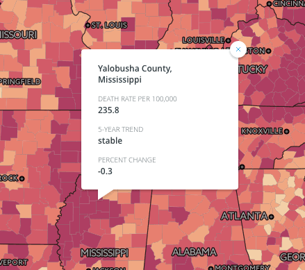
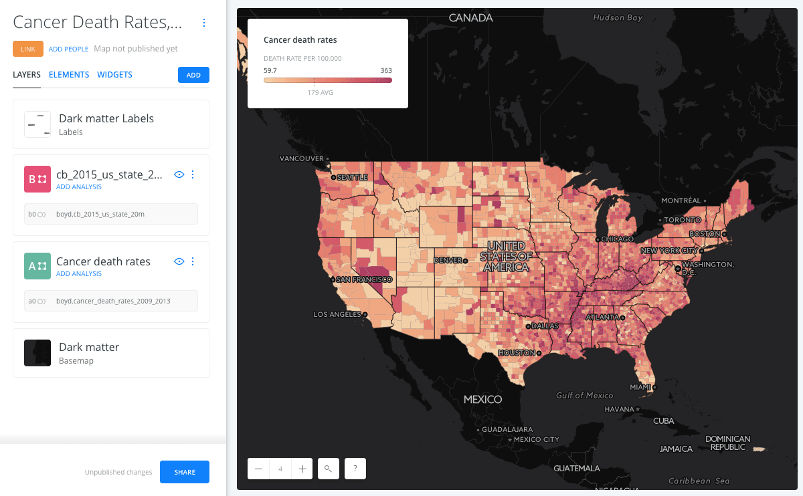
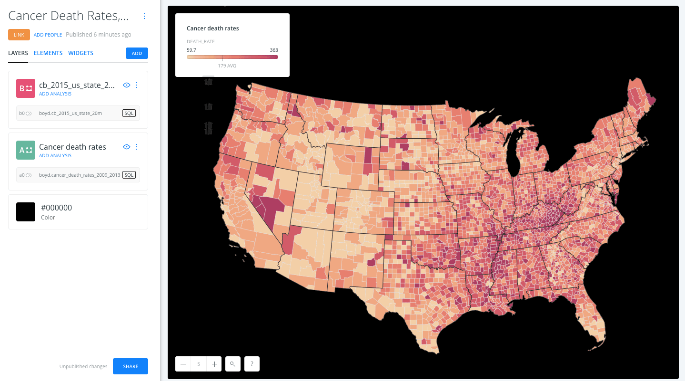

# Module 08 Lab Assignment

## Table of contents

<!-- TOC -->

- [Module 08 Lab Assignment](#module-08-lab-assignment)
    - [Table of contents](#table-of-contents)
    - [Cancer death rates by county (10 pts)](#cancer-death-rates-by-county-10-pts)
        - [Data files](#data-files)
        - [Required specifications of the deliverable](#required-specifications-of-the-deliverable)
        - [How to submit the deliverable](#how-to-submit-the-deliverable)
    - [Examples and suggestions](#examples-and-suggestions)
        - [Customizing the pop-up](#customizing-the-pop-up)
        - [Example of CARTO Builder project](#example-of-carto-builder-project)
        - [CARTO's default dynamic legend statistics](#cartos-default-dynamic-legend-statistics)
    - [Lab challenge: reprojecting your map](#lab-challenge-reprojecting-your-map)
    - [Useful resources](#useful-resources)

<!-- /TOC -->

The requirements of the map are listed below. All the tasks required to fulfill this assignment are documented within this and previous modules.

## Cancer death rates by county (10 pts)

The [National Cancer Institute](http://www.cancer.gov/) is raising awareness about cancer rates across America. They've hired you to build them an interactive web map and would like you to use CARTO to store the data and publish the map.

They have supplied you with a CSV dataset to use. The dataset contains 5-digit state and county FIPS codes with which you can use to join these data to county polygons. They've also supplied a file containing metadata about this dataset.

The requirements for the map are listed below. Tasks required to fulfill this assignment are documented within this and previous Modules, as well as through the [CARTO help and documentation](http://docs.CARTO.com/).

### Data files

* Find on Canvas the *cancer_deaths_2016.csv.zip* which contains the .csv, .csvt, and metadata file for 5-year cancer rates by county.
* Use existing county and state polygon layers or import data directly to CARTO from techniques learned in the lesson.

### Required specifications of the deliverable

1) The CARTO map must fulfill the following requirements:

> * The web map will show the distribution of cancer rates averaged over a 5-year period by US county as a choropleth map type, using either a 5 or 7 class quantile classification method, and a color scheme of your choosing.
> * An info window pop-up allowing the user to derive the name of the county, the state name, the death rate, and trend upon clicking a county.
> * A legend with customized wording, e.g., remove the underscores and make it friendlier to read.
> * State outlines
> * Include basic metadata for the map and each layer

2) The client has requested that the CARTO map be embedded in a web page that better shows the metadata for the project. Use the _index.html_ in the *lesson-map* folder as a template.

> * Map needs to be an `iframe` element in the web page
> * A link should be provided to full-screen version
> * The web page must have must have a meaningful title (both in the header title element and in the h1 element) and metadata about the author, data source, and brief description of purpose.
> * Contact information in footer must be tuned to you, the author.
> * The map page must be called "index.html" in the repo folder *lab-08/map*. The (private) URL should be similar to: _newmapsplus/map671-module-08-username/lab-08/map_

### How to submit the deliverable

* Commit and push your final project to the lesson repository. Submit the repo URL to Canvas, e.g, *https://github.com/newmapsplus/map671-module-08-username*

## Examples and suggestions

Look at the [../lesson-map/index.html](../lesson-map/index.html) is this repo to find an example using the challenge option below. You'll need to enable your live web server to view this page locally.

### Customizing the pop-up

You can improve the usability of your interactive information beyond the default field and column names populated by CARTO in both the pop-up and legend. Please change the default values to a more descriptive, readable value.

In previous lessons, we explored string concatenation methods in PostGIS to develop pop-up content. Access the SQL window in CARTO to concatenate fields for your pop-ups.

   
Customize your pop-up

### Example of CARTO Builder project

   
Example of a project in CARTO Builder

### CARTO's default dynamic legend statistics

Notice how the the legend adds a _AVG_ statistic? This is a dynamic calculation assuming that you are working with raw data. Adjust the legend value manually to remove this calculation.

Why? This data has already been normalized and you cannot find an average without having the raw values. Consider a city with two neighborhoods and we're comparing rates of White Castle hamburger joints to population:
* Neighborhood A has 10 people and 1 burger joint. That's 1 to 10 or a rate of 10 burger joints per 100 population.
* Neighborhood B has 50 people and 1 burger joint. That's 1 to 50 or a rate of 2 burger joints per 100 population.

The average is not 6 burger joints per 100 people in the city, but rather 2 to 60 or a rate of 3.3 burger joints per 100.

## Lab challenge: reprojecting your map

As we've learned, choropleth maps are best displayed using an equal area projection. A common complaint about web maps is that for the most part they all used the Web Mercator projection, which of course distorts area as you move toward the poles, and therefore were not ideally suited for displaying choropleth maps. However, very recently this has begun to change, and CARTO is helping to lead this charge.

This recent blog post by CARTO, [APPLY THE ALBERS PROJECTION WITH A SQL QUERY](https://carto.com/learn/guides/data-and-sql/apply-the-albers-projection-with-a-sql-query), provides us with some guidance for reprojecting our web map to be an equal area projection. You should find this very easy with your experience in PostGIS!

   
Example of a Albers equal-area conic projection in CARTO Builder

**Tip:** In past semesters, some students have had trouble adding new projections to their CARTO database. If you run into errors, trying to add North America Albers Equal Area Conic projection (EPSG: 102008) to your database, use the already installed US National Atlas Equal Area (EPSG: 2163) instead.

## Useful resources

The following websites will help customize the look of your CARTO map with common web markup languages.

* Reference for HTML and CSS: [http://www.w3schools.com/](http://www.w3schools.com/) and also check on the SQL section.
* CartoCSS reference on CARTO.com: [https://carto.com/docs/carto-engine/cartocss/properties](https://carto.com/docs/carto-engine/cartocss/properties/)
